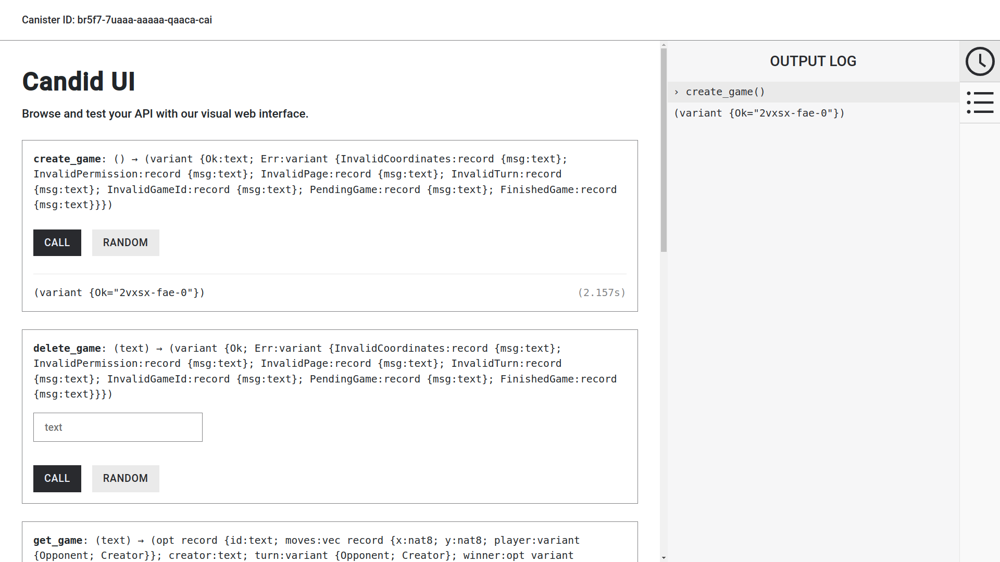
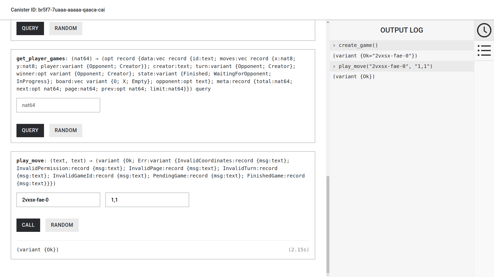
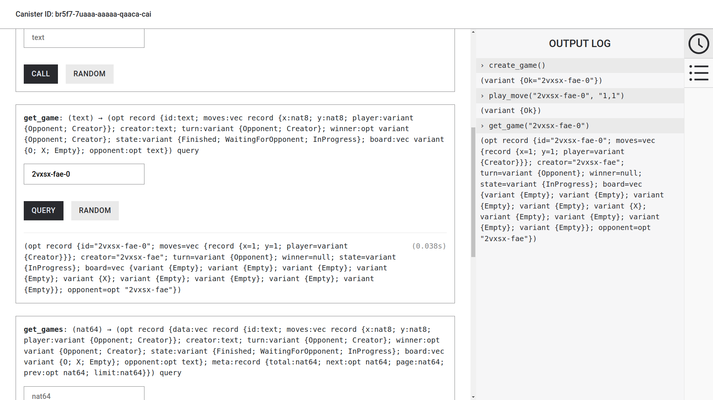

# TicTacToe

## Abstract
Tic-tac-toe, noughts and crosses, or Xs and Os is a paper-and-pencil game for two players who take turns marking the spaces in a three-by-three grid with X or O. The player who succeeds in placing three of their marks in a horizontal, vertical, or diagonal row is the winner. [Wikipedia](https://en.wikipedia.org/wiki/Tic-tac-toe)

## Motivation
This project was created as my submisssion for the [Rust Smart Contract 101 Challenge](https://dacade.org/communities/icp/challenges/c04ec537-c4a7-4681-9c62-2b7571d55a5e) organized by [Dacade](https://dacade.org) x [Internet Computer](https://internetcomputer.org).
I decided on this project because I wanted to deploy a canister on the Internet Computer using Rust. Rust seems to be gaining a lot of popularity and so I figured that this would be great time to kill 2 birds with one stone 😁.

## Tech Stack
- [Rust](https://www.rust-lang.org)
- [Internet Computer Caniser Development Kit](https://docs.rs/ic-cdk/latest/ic_cdk/)
- [Candid IDL](https://github.com/dfinity/candid)

## Game Play
- Create a game by calling the `create_game` canister function

- Play a move by calling the `play_move` canister function.
  This canister function takes 2 arguments:
  - The id of the game
  - The coordinates of the move in the format `x,y` where x is the `x` coordinate of the move and `y` is y coordinate of the move

- You can view the game start by calling the `get_game` canister function and passing in the canister id

- Take turns in playing the game until a winner emerges... or the game ends in a draw; either way works 🤷

## Credits
- [Adophilus](https://github.com/Adophilus)
